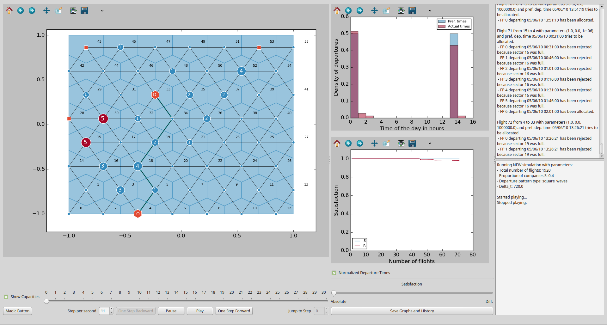

# ELSA Air Traffic Simulator -- Sector-based Strategic part

This is an Agent-Based model simulating the strategic allocation of flight plans in Air Traffic Management. It has been developped by the ELSA project, "Empirically grounded agent based models for the future ATM scenario", funded via the Work Package E of SESAR. It aims at studying some of the new concepts foreseen by SESAR. 

More information about SESAR can be found here:

[http://www.sesarju.eu/](http://www.sesarju.eu/)

More information about the ELSA project and its results can be found here:

[http://complexworld.eu/wiki/ELSA](http://complexworld.eu/wiki/ELSA)

A more complete model, based on navpoint trajectories and with a tactical part, can be found [here](https://github.com/ELSA-Project/ELSA-ABM). This version is sector-based and is aiming at providing a toy-model to study the main mechanisms of the flight plan allocation.



# Getting started

## Installation

First, create a directory where you see fit to host the code. Then download the code
either using git (preferred method) via `https://github.com/ELSA-project/ELSA-ABM-StratS.git`. You can also download the code directly by clicking on the 'download zip' button on the right hand side and extract the archive.

Note that the code has only been tested on linux distributions like Ubuntu, and only marginally on MAC OS. In the following we assume that the user has a Debian-like distribution.

The code is mainly written in Python 2 so you should install it before anything else, using:

```
sudo apt-get install python
```

Then you should make sure that all the dependencies required are installed. The following python modules should be installed:

* scipy
* numpy
* shapely
* networkx
* basemap
* MySQLdb
* matplotlib
* descartes
* scikit-learn

You can do this using the following command (tested on Mint 17 and Ubuntu 14.04):

```
sudo apt-get install python-scipy python-numpy python-shapely python-networkx python-mpltoolkits.basemap python-matplotlib python-sklearn python-mysqldb
```

The package 'descartes' has to be installed separately using for instance pip:
```
sudo pip install descartes
```

If pip is not installed on your system, you can install it like this:
```
sudo apt-get install python-pip 
```

A full setup script is not provided yet


## Running the model

The following guidelines do not represent a full manual but will helpfully guide the user.

### Single simulation, GUI

The model is mainly designed to run in fast-time simulations to produce statistically significant output. However a basic GUI is included in the repository. One can launch the GUI like this:

```
python interface.py ../tests/example/my_paras_example.py ../tests/example/results_example
```

This runs the example included in the code. One can use the tests/example/my_paras_example.py file as a starting point to run their own model. The GUI is fairly simple, bu one can play the simulation, set the speed of the simulation, or do it step by step manually. The distribution of departures and the satisfactions of different types of companies are track. One can also record the graph at any time, including the map and the history. History can be replayed by choosing an history file to load at the bottom of the interface.py file.

### Fast Time simulations

The code is mainly design to run several instances of of a simulations to get good averages and sweep different parameters. 

This is done through two parameters files. The first one, of which a template can be found in `abm_strategic_model1/paras.py`, sets the main parameters of the simulation, which are explained in the template file. The second one, of which a template can be fuond in `abm_strategic_model1`, is used to choose the main parameters to loop. In a nutshell, `paras_to_loop` lists all the parameters to be looped on. Each of them must have a definition like `nA_iter`, which is a list of value to loop for the parameter called `nA`. The parameter `n_iter` sets the number of realizations for each set of values of the parameters. Note that this file must point to a `paras.py` file to get all the relevant parameters (which are not looped).

The model can then be run using:

```
python iter_simO.py paras_iter.py
```

The results are saved in the location set by the `results_dir` variable, which can be found in `paths.py`. The individual runs on the parameters can be gathered using the function `get_results` in the `performance_plots.py`. Some example of scripts are present in the `scripts` directory and can be used as insipiration for running the model.

### Network Builder

The network can be built by the user in different ways. Essentially, the user needs to use a parameters file, of which a template is given in `abm_strategic_model1/paras_G`. The user can generate a fully synthetic network or use some external data. See the template file for more information. 

The network itself can then be built using:

```
python prepare_network paras_G.py networks
```

Where the first argument is the path to the parameter file and the second argument is the path used to save the results.

Finally, note that the user, when running `iter_simO.py`, can also loop on different network. This is done by appending `G` to the list `paras_to_loop` and generating these networks beforehand. To do this, one must use another parameter file, of which a template is given in `abm_strategic_model1/paras_G_iter.py`. The template is only displaying the procedure to have different airports on the same network, but one can modify. This file needs also to point at the corresponding `paras_G.py` file. 

The different networks are then generated using the `iter_airport_change` in the `iter_simO.py` file. Some examples on how to use this function are present in the scripts too, for instance `produce_LongEarth.py`. Finally, when running the simulations themselves, one has to point at a file generated by `iter_airport_change` by putting the path in the variables `paras['file_list_of_net_file']` in `paras_iter.py` file. 